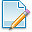

.. index:: 
   pair: User note; Edit

.. _editusernote:

Notes
=====

The user may want to include some notes on the quality control analysis reports. This is a checkable option that enables the :ref:`notestab`. The tab can be enabled by clicking the |usernote| button on the :ref:`maintoolbar` or by selecting 'Notes' from the :ref:`editmenu`.

