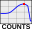

.. index::
   pair: Maximum Count Rate; Nuclear Medicine

.. _maxcountrate:

Maximum Count Rate Analysis
===========================

Determines the image with the maximum counts from a series of Gamma Camera images. A single multiframe image can be used or a series of images. The analysis can be opened by clicking the |mcr| button on the :ref:`nmtoolbar` or by selecting 'MCR' from the :ref:`nucmedmenu` analysis menu. Currently there are no settings available.

Please see `Max Count Rate <https://pylinac.readthedocs.io/en/latest/nuclear.html#max-count-rate>`_ in the `Pylinac documentation <https://pylinac.readthedocs.io/en/latest/>`_ for more information.

