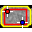

.. index::
   pair: Planar Uniformity; Nuclear Medicine

.. _planaruniformity:

Planar Uniformity Analysis
==========================

Calculates the integral and differential uniformity of each head in counts per second per becquerel of a Gamma Camera image. The analysis can be opened by clicking the |pu| button on the :ref:`nmtoolbar` or by selecting 'Simple Sensitivity' from the :ref:`nucmedmenu` analysis menu. Currently no settings are available.

Please see `Planar Uniformity <https://pylinac.readthedocs.io/en/latest/nuclear.html#planar-uniformity>`_ in the `Pylinac documentation <https://pylinac.readthedocs.io/en/latest/>`_ for more information.

