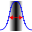

.. index::
   pair: Spatial Resolution; Nuclear Medicine

.. _spatialres:

Spatial Resolution Analysis
===========================

Calculates the spatial resolution of a Gamma Camera image.The analysis can be opened by clicking the |sr| button on the :ref:`nmtoolbar` or by selecting 'Spatial Resolution' from the :ref:`nucmedmenu` analysis menu. The spatial resolution test type can be selected from the list box below the |sr| button. The default test can be specified in :ref:`spatialressettings`. Currently available test types are:

.. toctree::
   :maxdepth: 1

   LQHelp9-4-4-1.rst
   LQHelp9-4-4-2.rst

While the default settings are usually sufficient certain settings can be changed as given in :ref:`spatialressettings`.

.. |Note| image:: _static/Note.png
