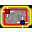

.. index::
   pair: Nuclear Medicine; Toolbar

.. _nmtoolbar:

Nuclear Medicine Tool Bar
=========================

The Nuclear Medicine tool bar provides methods to analyse DICOM images from static Gamma cameras, SPECT and PET. The analysis is done via the `Nuclear Module <https://pylinac.readthedocs.io/en/latest/nuclear.html>`_ and results are returned as a PDF report. No checking is done by the tests to see if the images are suitable. For trouble shooting please see the `Pylinac documentation <https://pylinac.readthedocs.io/en/latest/>`_.

*  |mcr| :ref:`maxcountrate`
*  |ss| :ref:`simplesens`
*  |pu| :ref:`planaruniformity`
*  |sr| :ref:`spatialres`
*  |tu| :ref:`tomouniformity`
*  |tr| :ref:`tomores`
*  |cor| :ref:`centreofrotation`
*  |tc| :ref:`tomocontrast`

.. toctree::
   :maxdepth: 1
   :hidden:

   LQHelp9-4-1.rst
   LQHelp9-4-2.rst
   LQHelp9-4-3.rst
   LQHelp9-4-4.rst
   LQHelp9-4-5.rst
   LQHelp9-4-6.rst
   LQHelp9-4-7.rst
   LQHelp9-4-8.rst

.. |mcr| image:: _static/MaxCount.png

.. |ss| image:: _static/SimpleSensitivity.png

.. |sr| image:: _static/SpatialRes.png

.. |tc| image:: _static/TomoContrast.png
