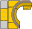

.. index::
   pair: Main; Toolbar

.. _maintoolbar:

Main Tool Bar
=============

The main toolbar provides short cuts for commonly used actions such as opening or saving an image or dataset. It is also used to enable or disable the analysis toolbars. The items are grouped into three sections as shown below:

Opening and saving images and datasets
--------------------------------------

*  |open| :ref:`fileopen`
*  |openref| :ref:`fileopenref`
*  |save| :ref:`filesave`

Performing analysis
-------------------

To perform an analysis or operation the appropriate toolbar must be enabled. Toolbars can be permanently enabled/disabled from the :ref:`settings` window under the 'Window' group.

*  |rx| :ref:`rxtoolbar`
*  |dx| :ref:`dxtoolbar`
*  |nm| :ref:`nmtoolbar`
*  |dcm| :ref:`dcmtoolbar`

Control functions
-----------------

These are miscellaneous functions.

*  |note| :ref:`editusernote`
*  |settings| :ref:`settings`
*  |help| :ref:`helpabout`
*  |exit| :ref:`exitmenu`

.. toctree::
   :maxdepth: 1

   LQHelp8-2-3.rst

.. |openref| image:: _static/OpenRef.png

.. |note| image:: _static/EditNotes.png

.. |help| image:: _static/Help.png

